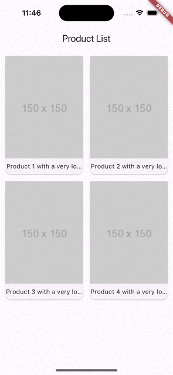

# Dismissible Page Hero

Este projeto demonstra uma lista de produtos com animações de transição usando o Hero e uma página de detalhes de produto que pode ser descartada deslizando (Dismissible).

## Funcionalidades

- Lista de produtos em um layout de grade.
- Animação de transição entre a lista de produtos e a página de detalhes usando o Hero.
- Página de detalhes de produto com imagem de fundo e texto ajustável.
- A página de detalhes pode ser descartada deslizando para cima, baixo ou para os lados.
- Animação de transição suave entre as páginas.
- Feedback háptico ao deslizar para descartar a página.

## Tecnologias Utilizadas

- Flutter
- GoRouter para navegação
- Hero Widget para animações de transição
- CustomTransitionPage para transições customizadas
- DismissiblePage para a funcionalidade de descartar páginas

## APP

